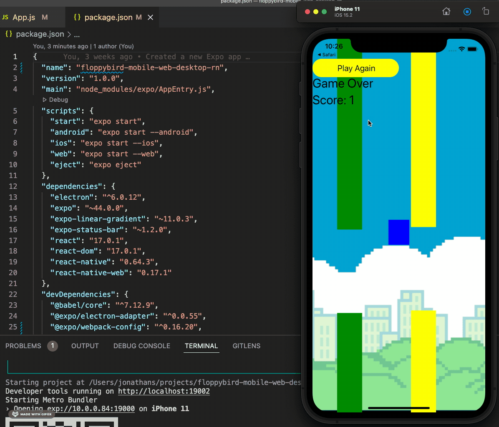
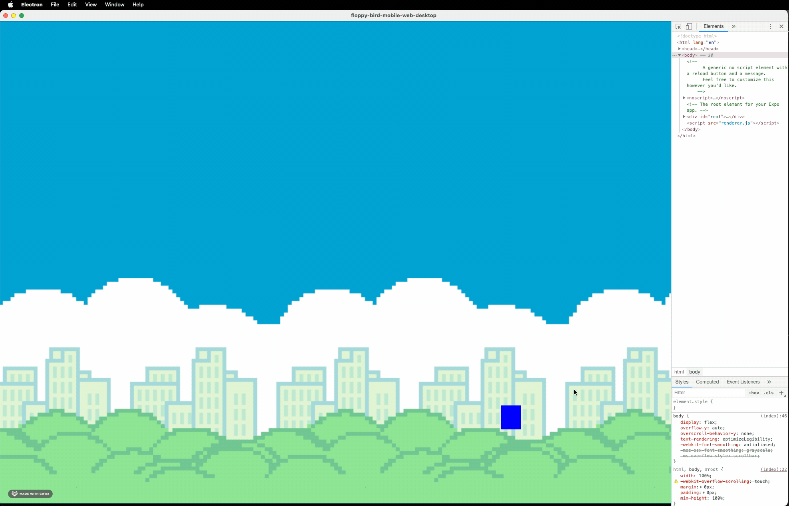
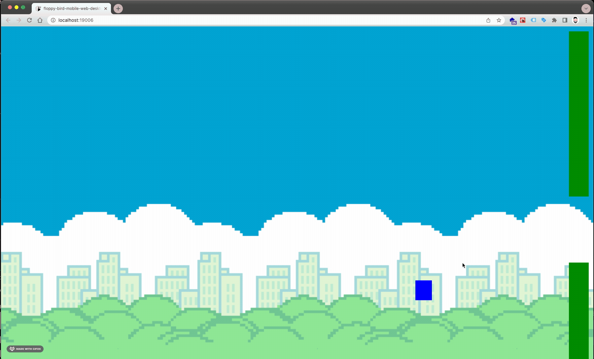

# Floppy Bird game - for web, desktop & mobile

## Build with - Expo for React Native

One source code to build for 6 platforms:

1. **Web** - with React Native for Web
2. **IOS** - default RN
3. **Android** - default RN
4. **Windows** - with electron-builder
5. **MAC OS** - with electron-builder
6. **Linux** - with electron-builder

## IOS build
1. `yarn ios` - to run in simulator
2. `yarn build:ios` - to generate build 

## DROID build
1. `yarn android` - to run in simulator
2. `yarn build:android` - to generate build 

---

## ELECTRON build
1. `yarn add -D @expo/electron-adapter` - add electron adapter to Expo project
2. `yarn expo-electron` - to add expo-electron
3. `yarn expo-electron start` - to start electron project
4. `yarn add -D electron-builder` - to build project

---

## WEB build

1. `expo web` - to run on web
2. `expo build:web` - to create build folder
3. `npx serve web-build` - to serve build folder

---

